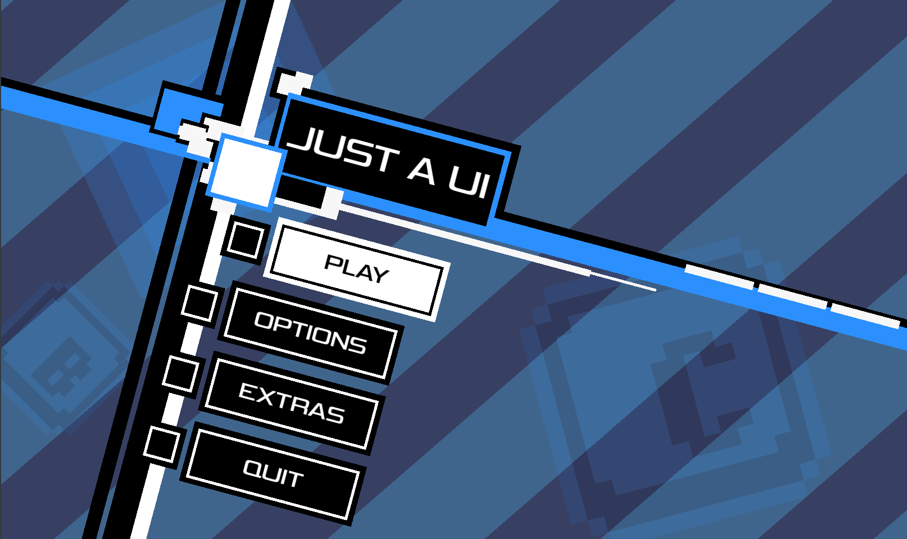
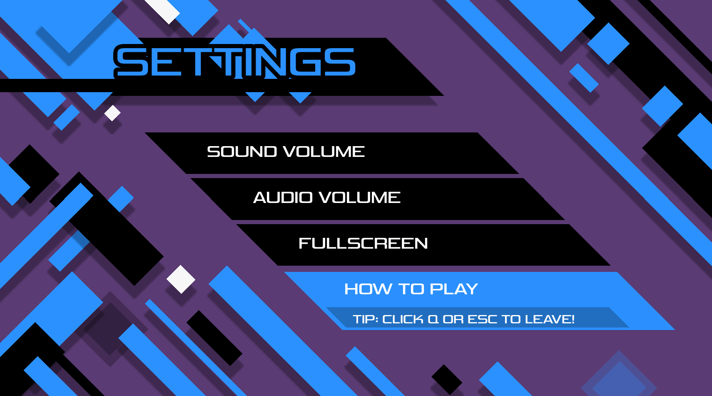
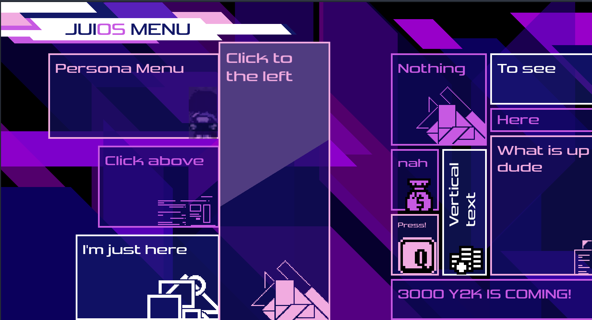
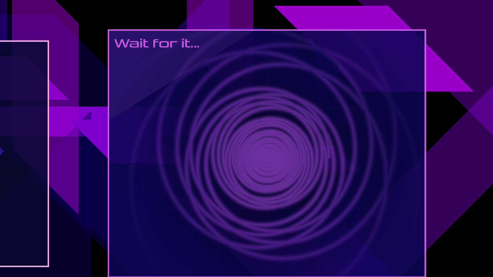
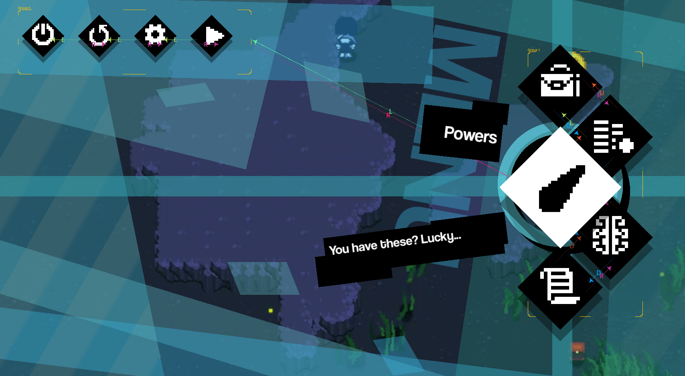

# Just U and I

<!-- PROJECT SHIELDS -->
<!--
*** I'm using markdown "reference style" links for readability.
*** Reference links are enclosed in brackets [ ] instead of parentheses ( ).
*** See the bottom of this document for the declaration of the reference variables
*** for contributors-url, forks-url, etc. This is an optional, concise syntax you may use.
*** https://www.markdownguide.org/basic-syntax/#reference-style-links
-->
<!--
[![Contributors][contributors-shield]][contributors-url]
[![Forks][forks-shield]][forks-url]
[![Stargazers][stars-shield]][stars-url]
[![Issues][issues-shield]][issues-url]
[![Unlicense License][license-shield]][license-url]
[![LinkedIn][linkedin-shield]][linkedin-url]-->

<!-- PROJECT LOGO -->
<!--
 

  

  <h3 align="center">Best-README-Template</h3>

  

	An awesome README template to jumpstart your projects!
	 
	<a href="https://github.com/othneildrew/Best-README-Template"><strong>Explore the docs »</strong></a>
	 
	 
	<a href="https://github.com/othneildrew/Best-README-Template">View Demo</a>
	&middot;
	<a href="https://github.com/othneildrew/Best-README-Template/issues/new?labels=bug&template=bug-report---.md">Report Bug</a>
	&middot;
	<a href="https://github.com/othneildrew/Best-README-Template/issues/new?labels=enhancement&template=feature-request---.md">Request Feature</a>
  

-->

<!-- TABLE OF CONTENTS -->

  
Table of Contents

  <ol>
	<a href="#about-the-project">About The Project</a>
	<li><a href="#built-with">Built With</a></li>
	</ul>
	<li><a href="#play">How to play?</a></li>
	<li><a href="#roadmap">Roadmap</a></li>
	<li><a href="#license">License</a></li>
	<li><a href="#contact">Contact</a></li>
	<li><a href="#acknowledgments">Acknowledgments</a></li>
  </ol>

<!-- ABOUT THE PROJECT -->
## About The Project

### Overall
Built for Hackclub Siege, this was a rather enormous undertaking for me. I thought I could just find some references, whip up some UI, and then be done for the day but... Scope creep caught up to me. Thank gosh Siege only allows for a week, otherwise this project would have been blown out of proportion. I will say that I have taken heavy inspiration from one person in particular, but this was also a testament to what I can do in Godot with my current skillset (and what I can do UI-wise). 

### What even is this?
A very simple UI-based game where the user explores, finds coins, and then unlocks the ending! Bonus points if they get all the blue coins! I will leave the question of how to get blue coins up to exploration since it's not difficult. Here's a nice feature list:
* 4 themed user interfaces to interact with
* Smooth transitions in between all menus
* Collectible gold and blue coins (3 of gold, and ? of blue)
* Nice sounds to go with the experience (see <a href="#acknowledgments">Acknowledgments</a> or 'ATTRIBUTIONS')
* Keyboard navigable user interface (currently doesn't work to pick up coins... that would be too easy!)
* A hidden ending that won't surprise you

### What do I take out of this?
Scope creep is definitely one. I came into this with big plans, and only got 4 sections done... The ending makes 5 but that doesn't really count. I did try making a mood board and a plan, but I found myself polishing features while the game wasn't finished yet. I think I should go with minimum viable product before going for polishing rounds, even if I feel like I have a time limit. 
Also, I learned a lot about how the Godot User Interface Nodes work: mouse_filter, containers, clip_contents, _gui_input(), etc. If we're talking strictly about Godot though, tweens are now my best friend. They do so much and are so nice (even though I don't do a good job of cleaning them up). 
Lastly, there was a moment when I woke up, opened up my code editor, and didn't comprehend what I had written at 12 am the night before. I gave myself the task of turning the code into a component, but it was so jank and slapped together that it took many hours to rewrite code that had taken barely an hour to initially put down. From now on, I will do my best to look ahead and compartmentalize things that will be used again, like the input system I made or the (lack of) a scene manager.

(<a href="#readme-top">back to top</a>)

### Screenshots
They’re fairly large, so I’ve tucked them into expandable sections:

  
<strong>Main Menu</strong>

  

  
<strong>Settings Menu</strong>

  

  
<strong>Operating System</strong>

  
  

  
<strong>Persona App</strong>

  

#### Notes
- The main menu has some subtle hints to encourage clicking, though I’m not sure they’re strong enough.  
- The settings screen isn’t a real settings menu—it’s just for show (like much of this project).  
- The OS has one more tile in-game, but I’ll let you discover that yourself—I spent a while on the shader.  
- The Persona app is named after the Persona-inspired UI. None of the buttons work (except quit), but they look neat.

> [!TIP]  
> Press `B` or `C` to see your blue and gold coin counts in the OS and Menu screens.  

> [!TIP]  
> Press `Q` or `ESC` to exit certain menus.  

> [!TIP]  
> Use arrow keys + Space/Enter to fully navigate menus with your keyboard.  
 

(<a href="#readme-top">back to top</a>)
 

(<a href="#readme-top">back to top</a>)

### Built With

This section should list any major frameworks/libraries used to bootstrap your project.

* [![Godot][Godot 4.4]][Godot-url]
* [ShaderToy](https://www.shadertoy.com) for shaders
<!--
* [![Next][Next.js]][Next-url]
* [![React][React.js]][React-url]
* [![Vue][Vue.js]][Vue-url]
* [![Angular][Angular.io]][Angular-url]
* [![Svelte][Svelte.dev]][Svelte-url]
* [![Laravel][Laravel.com]][Laravel-url]
* [![Bootstrap][Bootstrap.com]][Bootstrap-url]
* [![JQuery][JQuery.com]][JQuery-url]-->

(<a href="#readme-top">back to top</a>)

### Play 

If you'd like to build it yourself, I used Godot 4.4.1. I do have a pre-built web version available [here on my itch](https://pixelsaver.itch.io/just-u-and-i), but if you still insist on building this unoptimized mess, go ahead.

1. Install Godot 4.4
2. Download and unzip the code
3. Open the file with Godot project manager
4. Go to Project > Export, add whichever platform you're on (MacOS, Windows) and then click export.
5. You're good to go!

(<a href="#readme-top">back to top</a>)

<!-- ROADMAP -->
## Roadmap

- [x] Make the Main Menu
- [x] Make the Settings
- [x] Make the OS
- [X] Add coins
- [ ] Finish sounds (pull from Osu Lazer)
- [ ] Add tutorial / teach the user how to play
- [ ] Extra apps in the OS
  - [X] Persona looking ui for whatever in an app
  - [ ] Osu lazer main menu clone
  - [ ] Osu lazer radial menu clone
  - [ ] Mochibot

(<a href="#readme-top">back to top</a>)

<!-- LICENSE -->
## License

Distributed under the MIT License. See `LICENSE` for more information.

(<a href="#readme-top">back to top</a>)

<!-- CONTACT -->
## Contact

Pixel Saver - [itch.io](https://pixelsaver.itch.io/) 

Project Link: [https://github.com/PixelSaver/Just-U-and-I](https://github.com/PixelSaver/Just-U-and-I)

(<a href="#readme-top">back to top</a>)

<!-- ACKNOWLEDGMENTS -->
## Acknowledgments

Many thanks for these people for letting me use their work for free! See 'ATTRIBUTIONS.MD' for a cleaner look!

* The man who inspired me to do all of this, [Hipxel](https://github.com/Hipxel-dev) 
* My good friend [OfKnee](https://github.com/ofKnee) for the coin and blue coin spritesheets
* [Siege](https://siege.hackclub.com/castle), the YSWS that pushed me to do this.
* [Matiassinger's Readme Template](https://github.com/othneildrew/Best-README-Template)
* [Origami Dev Pete's TODO Manager Godot Addon](https://github.com/OrigamiDev-Pete/TODO_Manager)
* [Budzio's Godot Super Wakatime Addon](https://github.com/BudzioT/Godot_Super-Wakatime)
* ManTimesTwo's [Spatial Navigation Mapper Addon](https://github.com/Mantimestwo/Godot-spatial-navigation-mapper)
* [OSU](https://github.com/ppy/osu) and OSU Lazer soundbites from ppy
* glass_002.ogg by [Kenney.nl](www.kenney.nl)
* ui_reject.mp3 Sound Effect by <a href="https://pixabay.com/users/audley_fergine-32337609/?utm_source=link-attribution&utm_medium=referral&utm_campaign=music&utm_content=327756">Hanifi Şahin</a> from <a href="https://pixabay.com/sound-effects//?utm_source=link-attribution&utm_medium=referral&utm_campaign=music&utm_content=327756">Pixabay</a>
* Ansdor for the [button icons](https://ansdor.itch.io/button-icons)

* glitch_1.mp3, glitch_intro.mp3, glitch_logo.mp3, heartbeat.mp3 Sound Effect by <a href="https://pixabay.com/users/dragon-studio-38165424/?utm_source=link-attribution&utm_medium=referral&utm_campaign=music&utm_content=397982">DRAGON-STUDIO</a> from <a href="https://pixabay.com/sound-effects//?utm_source=link-attribution&utm_medium=referral&utm_campaign=music&utm_content=397982">Pixabay</a>
* glitch_2.mp3 Sound Effect by <a href="https://pixabay.com/users/kakaist-48093450/?utm_source=link-attribution&utm_medium=referral&utm_campaign=music&utm_content=312910">kave msri</a> from <a href="https://pixabay.com//?utm_source=link-attribution&utm_medium=referral&utm_campaign=music&utm_content=312910">Pixabay</a>
* glitch_3.mp3, glitch_4.mp3, glitch_reverb.mp3 Sound Effect by <a href="https://pixabay.com/users/sound_garage-47313534/?utm_source=link-attribution&utm_medium=referral&utm_campaign=music&utm_content=311803">SOUND_GARAGE</a> from <a href="https://pixabay.com//?utm_source=link-attribution&utm_medium=referral&utm_campaign=music&utm_content=311803">Pixabay</a>
* glass_shatter.mp3 Sound Effect by <a href="https://pixabay.com/users/freesound_community-46691455/?utm_source=link-attribution&utm_medium=referral&utm_campaign=music&utm_content=6898">freesound_community</a> from <a href="https://pixabay.com/sound-effects//?utm_source=link-attribution&utm_medium=referral&utm_campaign=music&utm_content=6898">Pixabay</a>

* Nikoichu for the [pixel icons](https://nikoichu.itch.io/pixel-icons)
* [Claude](https://claude.ai/) and [ChatGPT](https://chatgpt.com) who helped me write the editor scripts for tweenables (find them at `/Scripts/Editor/')

https://godotshaders.com/shader/pseudo-pixel-sorting-v2/
https://godotshaders.com/shader/glitch-effect-shader-for-godot-engine-4/
https://godotshaders.com/shader/glitch-transition/

<!--
* [Choose an Open Source License](https://choosealicense.com)
* [GitHub Emoji Cheat Sheet](https://www.webpagefx.com/tools/emoji-cheat-sheet)
* [Malven's Flexbox Cheatsheet](https://flexbox.malven.co/)
* [Malven's Grid Cheatsheet](https://grid.malven.co/)
* [Img Shields](https://shields.io)
* [GitHub Pages](https://pages.github.com)
* [Font Awesome](https://fontawesome.com)
* [React Icons](https://react-icons.github.io/react-icons/search)
-->

(<a href="#readme-top">back to top</a>)

<!-- MARKDOWN LINKS & IMAGES -->
<!-- https://www.markdownguide.org/basic-syntax/#reference-style-links -->
[contributors-shield]: https://img.shields.io/github/contributors/othneildrew/Best-README-Template.svg?style=for-the-badge
[contributors-url]: https://github.com/othneildrew/Best-README-Template/graphs/contributors
[forks-shield]: https://img.shields.io/github/forks/othneildrew/Best-README-Template.svg?style=for-the-badge
[forks-url]: https://github.com/othneildrew/Best-README-Template/network/members
[stars-shield]: https://img.shields.io/github/stars/othneildrew/Best-README-Template.svg?style=for-the-badge
[stars-url]: https://github.com/othneildrew/Best-README-Template/stargazers
[issues-shield]: https://img.shields.io/github/issues/othneildrew/Best-README-Template.svg?style=for-the-badge
[issues-url]: https://github.com/othneildrew/Best-README-Template/issues
[license-shield]: https://img.shields.io/github/license/othneildrew/Best-README-Template.svg?style=for-the-badge
[license-url]: https://github.com/othneildrew/Best-README-Template/blob/master/LICENSE.txt
[linkedin-shield]: https://img.shields.io/badge/-LinkedIn-black.svg?style=for-the-badge&logo=linkedin&colorB=555
[linkedin-url]: https://linkedin.com/in/othneildrew
[product-screenshot]: images/screenshot.png

[Godot]: https://godotengine.org/assets/press/icon_monochrome_dark.png
[Godot-url]: [https://github.com/godotengine/godot](https://godotengine.org)

[Next.js]: https://img.shields.io/badge/next.js-000000?style=for-the-badge&logo=nextdotjs&logoColor=white
[Next-url]: https://nextjs.org/
[React.js]: https://img.shields.io/badge/React-20232A?style=for-the-badge&logo=react&logoColor=61DAFB
[React-url]: https://reactjs.org/
[Vue.js]: https://img.shields.io/badge/Vue.js-35495E?style=for-the-badge&logo=vuedotjs&logoColor=4FC08D
[Vue-url]: https://vuejs.org/
[Angular.io]: https://img.shields.io/badge/Angular-DD0031?style=for-the-badge&logo=angular&logoColor=white
[Angular-url]: https://angular.io/
[Svelte.dev]: https://img.shields.io/badge/Svelte-4A4A55?style=for-the-badge&logo=svelte&logoColor=FF3E00
[Svelte-url]: https://svelte.dev/
[Laravel.com]: https://img.shields.io/badge/Laravel-FF2D20?style=for-the-badge&logo=laravel&logoColor=white
[Laravel-url]: https://laravel.com
[Bootstrap.com]: https://img.shields.io/badge/Bootstrap-563D7C?style=for-the-badge&logo=bootstrap&logoColor=white
[Bootstrap-url]: https://getbootstrap.com
[JQuery.com]: https://img.shields.io/badge/jQuery-0769AD?style=for-the-badge&logo=jquery&logoColor=white
[JQuery-url]: https://jquery.com 
